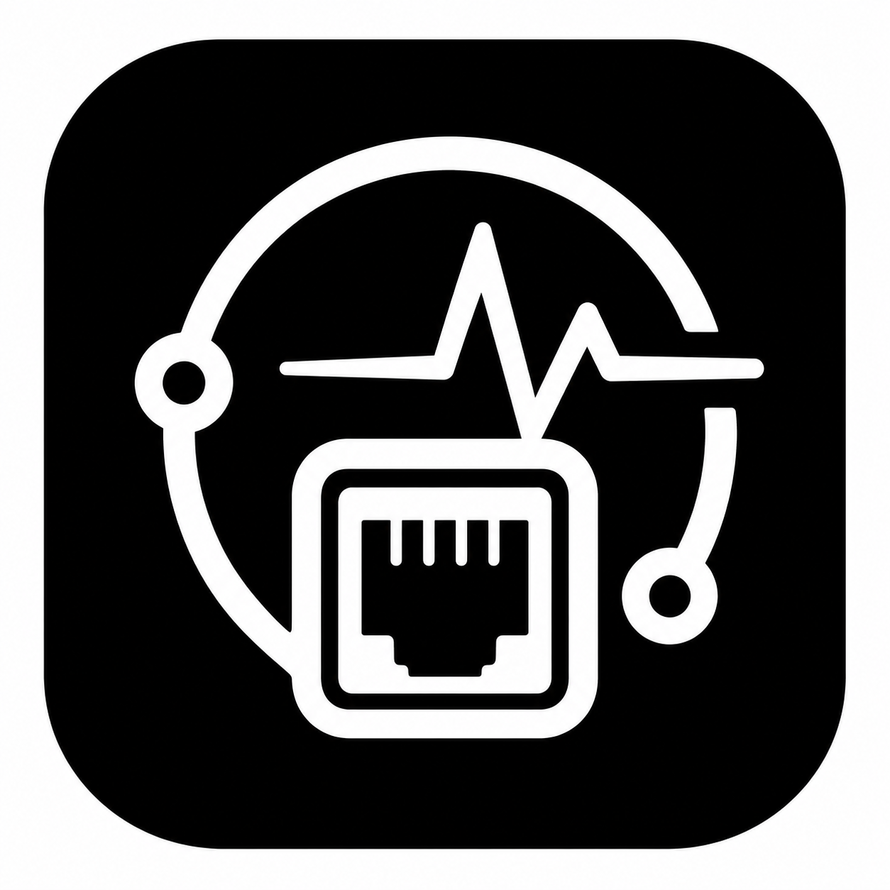

# What's Live



What's Live is a small macOS menu bar app for seeing what local development services are currently running.

It scans listening ports, groups them by process, highlights services that are probably stale, and gives you cautious stop controls for things like Node, Python, Rust, model servers, Docker containers, and simulators.

## Features

- Menu bar live breakdown of running developer services, such as `Py 2 · Node 1`, plus probably stale services.
- Compact sections for stale, running, and protected services.
- Detail window with pid, command, cwd, port, HTTP probe, age, and classification reason.
- Safety-aware stop controls:
  - One-click stop for clear dev servers.
  - Confirmation for model servers, Docker containers, simulators, and unknown processes.
  - Protected defaults for databases and system-ish processes.
- Settings for stale threshold, scan interval, ignored ports, protected names, Docker probing, and Ollama probing.
- Installs as a normal macOS app so Spotlight can find it as `What's Live`.

## Build

```bash
swift test
./script/build_and_run.sh
```

## Install For Spotlight

```bash
./script/install_app.sh
```

The installer builds the app, verifies it launches, and copies it to:

```text
~/Applications/What's Live.app
```

After that, search Spotlight for `What's Live`.

## Notes

What's Live does not require admin permissions. It only stops processes the current user can stop, and it never auto-kills anything based on stale status.

On the author's Mac, the release build idles around 27 MB RSS with effectively 0% CPU.

## License

MIT
